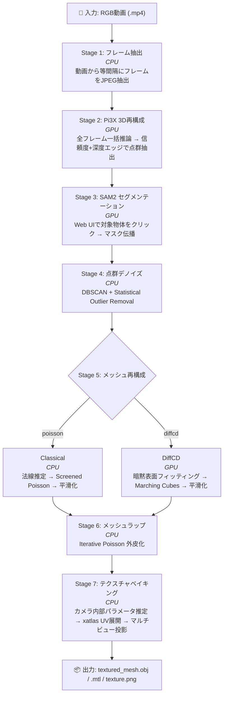

# im2pc-pipeline

RGB動画から テクスチャ付き3Dメッシュ (OBJ) を生成する Docker 完結型パイプライン。

Pi3X による多視点3D再構成、SAM2 によるインタラクティブ物体セグメンテーション、古典手法 (法線推定 + Screened Poisson) / DiffCD のメッシュ化、マルチビューテクスチャベイキングを1コンテナで実行する。

## 現在の実装状態 (2026-02-09)

- ステージ順序は **Stage 2 = Pi3X**, **Stage 3 = SAM2** (Dashboard/CLIとも共通)
- Dashboard は `data/output/objects/<object_name>/` 単位で成果物を管理し、ステージ途中からの再開をサポート
- `SAM2_MODEL` は現状コード上で `large` 固定ロード (`scripts/stage_sam2_ui.py`) で、選択UIは将来拡張用

## パイプライン概要



## 動作環境

| 項目 | 要件 |
|------|------|
| GPU | NVIDIA (CUDA Compute ≥ 7.0), VRAM 16GB 推奨 |
| Docker | 20.10 以上 + Docker Compose v2 |
| NVIDIA Container Toolkit | nvidia-docker2 または nvidia-container-toolkit |
| OS | Linux (Ubuntu 22.04 で検証済み) |

## クイックスタート

```bash
# 1. リポジトリクローン
git clone <repo-url> && cd im2pc-pipeline

# 2. Docker イメージビルド (初回 15〜30分)
docker compose build

# 3. 入力動画を配置
cp /path/to/video.mp4 data/input/

# 4. Web ダッシュボード起動
docker compose up
```

ブラウザで **http://localhost:7860** を開くと Web ダッシュボードが表示される。

1. **Video** ドロップダウンで動画を選択
2. **Target Object** で既存オブジェクトを選択、または新規 `Object Name` を入力
3. パラメータを必要に応じて調整 (Advanced Settings で詳細設定)
4. **Start Pipeline** をクリック
5. Stage 3 で SAM2 Canvas がアクティブになるので、対象物体を左クリック (除外は右クリック)
6. **Confirm & Propagate** で全フレームにマスク伝播 → 残りのステージは自動進行
7. ログ・進捗・3Dプレビューをリアルタイムで確認
8. キャンセル/停止後の再開は、ステージバーで再開したいタスクを選択して **Start Pipeline** をクリック

## 使い方

### Web ダッシュボード (推奨)

```bash
# ダッシュボード起動
docker compose up

# バックグラウンド起動
docker compose up -d

# ログ確認 (バックグラウンド時)
docker compose logs -f

# 停止
docker compose down
```

ブラウザで http://localhost:7860 を開き、GUI から全操作を行う。

**ダッシュボード機能:**

- **動画選択**: `/data/input/` に配置した動画ファイルを自動検出
- **オブジェクト切替**: `Target Object` で対象オブジェクトを切替、`Object Name` で新規作成
- **生成物一覧**: 選択中オブジェクトの主要成果物をパネル表示
- **パラメータ設定**: 全ステージのパラメータを GUI から変更可能
- **SAM2 Canvas**: 左クリック = ポジティブポイント、右クリック = ネガティブポイント。Undo / Clear / Confirm & Propagate
- **進捗バー**: 7ステージの状態をリアルタイム表示 (Stage 5 は Classical / DiffCD の分岐切替対応)
- **再開操作**: 停止中は、現在選択中のステージタブから `Start Pipeline` で再開
- **ログビューア**: WebSocket 経由でリアルタイムストリーミング
- **3D プレビュー**: three.js による点群・メッシュのインタラクティブ表示 (回転・ズーム)
- **フレームギャラリー**: 抽出フレーム・マスクのサムネイル一覧

### CLI 実行 (後方互換)

従来の CLI パイプラインも引き続き利用可能:

```bash
# ENTRYPOINT を上書きして CLI モードで実行
docker compose run --rm --service-ports \
  --entrypoint python3 \
  pipeline /app/scripts/pipeline.py /data/input/video.mp4

# パラメータ指定
docker compose run --rm --service-ports \
  --entrypoint python3 \
  -e MAX_FRAMES=20 \
  -e PIXEL_LIMIT=150000 \
  pipeline /app/scripts/pipeline.py /data/input/video.mp4

# 途中再開 (ステージ N から)
docker compose run --rm --service-ports \
  --entrypoint python3 \
  pipeline /app/scripts/pipeline.py /data/input/video.mp4 --skip-to 4
```

> **注意**: CLI モードでは Stage 3 で Gradio UI が起動する。

### 個別ステージ実行

```bash
# フレーム抽出のみ
docker compose run --rm --entrypoint python3 pipeline \
  /app/scripts/stage_extract_frames.py /data/input/video.mp4 /data/output

# デノイズのみ
docker compose run --rm --entrypoint python3 pipeline \
  /app/scripts/stage_denoise.py /data/output/object.ply /data/output
```

## 環境変数

### フレーム抽出 (Stage 1)

| 変数 | デフォルト | 説明 |
|------|-----------|------|
| `FRAME_INTERVAL` | `10` | N フレームごとに1枚抽出 |
| `MAX_FRAMES` | `50` | 抽出フレーム数の上限 (Pi3X入力でも上限として使用) |

### Pi3X 3D再構成 (Stage 2)

| 変数 | デフォルト | 説明 |
|------|-----------|------|
| `PIXEL_LIMIT` | `255000` | フレームあたり最大ピクセル数 (必要時のみリサイズ) |
| `CONFIDENCE_THRESHOLD` | `0.2` | 信頼度フィルタ閾値 |
| `EDGE_RTOL` | `0.03` | 深度エッジフィルタの相対許容値 |
| `ALIGN_CAMERA_PLANE` | `1` | `1` でカメラ軌道平面を基準面(XZ)へ自動整列。カメラ向き(前/下)を使って上下反転も補正 (`0` で無効) |

### SAM2 セグメンテーション (Stage 3)

| 変数 | デフォルト | 説明 |
|------|-----------|------|
| `SAM2_MODEL` | `large` | SAM2 モデルタイプ設定 (現状実装では `large` 固定ロード) |

### メッシュ再構成 (Stage 5)

| 変数 | デフォルト | 説明 |
|------|-----------|------|
| `MESH_METHOD` | `poisson` | Stage 5 の既定手法 (`poisson` or `diffcd`) |

#### Classical (Normals + Poisson)

| 変数 | デフォルト | 説明 |
|------|-----------|------|
| `CLASSICAL_PREPROCESS_ENABLED` | `1` | Classical入力点群の前処理 (軽量フィルタ + リサンプリング) を有効化 |
| `CLASSICAL_PREPROCESS_VOXEL_RATIO` | `0.003` | 前処理ボクセルサイズの bbox 対角比 |
| `CLASSICAL_PREPROCESS_MAX_POINTS` | `700000` | この点数を超える場合に前処理でボクセル間引きを実行 |
| `CLASSICAL_PREPROCESS_SOR_NEIGHBORS` | `20` | 前処理 SOR の近傍数 |
| `CLASSICAL_PREPROCESS_SOR_STD_RATIO` | `2.8` | 前処理 SOR の標準偏差倍率 |
| `POISSON_DEPTH` | `9` | Poisson 再構成の深さ |
| `POISSON_NORMAL_RADIUS_RATIO` | `0.02` | 法線推定半径の bbox 対角比 |
| `POISSON_DENSITY_TRIM_QUANTILE` | `0.02` | 低密度頂点を除去する分位点 |
| `CLASSICAL_POST_MIN_COMPONENT_TRIANGLES` | `400` | 後処理で除去する小連結成分の最小三角形数閾値 |
| `CLASSICAL_POST_MIN_COMPONENT_RATIO` | `0.01` | 後処理で除去する小連結成分の最大成分比閾値 |
| `CLASSICAL_AUTO_SMOOTH` | `0` | 後処理スムージングを自動適用 (`1`で有効) |
| `CLASSICAL_SMOOTH_ITERATIONS` | `2` | 後処理スムージングの反復回数 |
| `CLASSICAL_DOWNSAMPLE_ENABLED` | `1` | 面数過多時のダウンサンプリングを有効化 |
| `CLASSICAL_DOWNSAMPLE_TARGET_FACES` | `100000` | ダウンサンプリング後の目標面数 |
| `CLASSICAL_DOWNSAMPLE_TRIGGER_FACES` | `140000` | この面数を超えた場合にダウンサンプリング実行 |

> Dashboard実行時のClassical Meshは `Preprocess -> Main Poisson -> Postprocess -> Downsample` を順に実行し、
> 各サブタスク完了ごとに承認（Continue）が必要です。

#### DiffCD

| 変数 | デフォルト | 説明 |
|------|-----------|------|
| `DIFFCD_BATCH_SIZE` | `5000` | バッチサイズ |
| `DIFFCD_N_BATCHES` | `30000` | 学習バッチ総数 |
| `DIFFCD_RESOLUTION` | `512` | Marching Cubes 解像度 |
| `DIFFCD_AUTO_TUNE` | `1` | GPU VRAM に応じて `BATCH_SIZE/N_BATCHES` を自動調整 |
| `DIFFCD_AUTO_TUNE_RESPECT_MANUAL` | `1` | 手動値 (`BATCH_SIZE/N_BATCHES/RESOLUTION`) を指定した場合は自動調整を無効化 |
| `DIFFCD_AUTO_KEEP_EFFECTIVE_SAMPLES` | `1` | `batch_size * n_batches` をなるべく維持して品質低下を防止 |
| `DIFFCD_AUTO_MIN_N_BATCHES` | `10000` | 自動調整時の `n_batches` 下限 |
| `DIFFCD_AUTO_SELECT_GPU` | `1` | 複数GPU時に空きVRAM最大のGPUを自動選択 (`CUDA_VISIBLE_DEVICES=all` の場合) |
| `DIFFCD_GPU_INDEX` | unset | DiffCD を固定GPUで実行したい場合の GPU index |
| `DIFFCD_XLA_MEM_FRACTION` | auto | JAX メモリ確保率を手動指定 (未指定時は VRAM 余裕から自動設定) |
| `JAX_COMPILATION_CACHE_DIR` | `/root/.cache/jax_compilation_cache` | JAX コンパイルキャッシュ保存先 (2回目以降の起動高速化) |

### メッシュラップ (Stage 6)

| 変数 | デフォルト | 説明 |
|------|-----------|------|
| `MESH_WRAP_ENABLED` | `1` | Stage 6 の有効/無効 |
| `MESH_WRAP_METHOD` | `poisson_iterative` | Wrap 手法 (`ipsr` 指定時は現状フォールバック) |
| `MESH_WRAP_ITERATIONS` | `1` | Wrap 反復回数 |
| `MESH_WRAP_SAMPLE_POINTS` | `180000` | 各反復の点サンプル数 |
| `MESH_WRAP_POISSON_DEPTH` | `8` | Wrap Poisson 深さ |

### テクスチャベイキング (Stage 7)

| 変数 | デフォルト | 説明 |
|------|-----------|------|
| `TEXTURE_SIZE` | `2048` | テクスチャアトラスの解像度 (px) |

## docs タスク別ドキュメント

詳細は `docs/<task_name>.md` 形式で整理:

- `docs/extract_frames.md`
- `docs/pi3x_reconstruct.md`
- `docs/sam2_segment.md`
- `docs/denoise_point_cloud.md`
- `docs/mesh_classical.md`
- `docs/mesh_diffcd.md`
- `docs/mesh_wrap.md`
- `docs/texture_bake.md`

## 出力ファイル

パイプライン完了後、`data/output/objects/<object_name>/` に以下が生成される:

```
data/output/
└── objects/
    └── <object_name>/
        ├── object_full.ply        # Stage 2出力 (信頼度 + 深度エッジ適用済み点群)
        ├── pi3x_cache.npz         # Stage 2/3間キャッシュ (点群・色・マスク)
        ├── textured_mesh.obj      # 最終成果物: テクスチャ付き3Dメッシュ
        ├── textured_mesh.mtl      # マテリアル定義
        ├── texture.png            # テクスチャアトラス (2048x2048)
        ├── object_mesh.ply        # Stage 5出力メッシュ (後処理 + 必要時ダウンサンプル済み)
        ├── object_mesh_wrapped.ply # Stage 6出力メッシュ (Texture用ラップ結果)
        ├── object_mesh_raw.ply    # Stage 5の平滑化前メッシュ
        ├── object_mesh_postprocessed.ply  # Stage 5後処理後メッシュ
        ├── object_mesh_input.ply  # Stage 5前処理後点群
        ├── object_denoised.ply    # デノイズ済み点群
        ├── object.ply             # Pi3Xトリプルフィルタ済み点群
        ├── camera_poses.json      # カメラ外部パラメータ + 使用フレームindex + 整列メタ情報
        ├── intrinsics.json        # 推定カメラ内部パラメータ
        ├── frames/                # 抽出フレーム画像 (JPEG)
        ├── masks/                 # SAM2セグメンテーションマスク (PNG)
        ├── classical_mesh/        # Classical( Poisson ) 作業ディレクトリ
        └── diffcd/                # DiffCD作業ディレクトリ
```

## アーキテクチャ

### Web ダッシュボード

```
┌─ Browser (localhost:7860) ─────────────────────────────┐
│  Vanilla HTML/CSS/JS (ビルドツール不要)                   │
│  WebSocket ←→ ログ・進捗リアルタイム配信                   │
│  REST API  ←→ パイプライン制御 / SAM2 / プレビュー        │
│  HTML5 Canvas ← SAM2 クリック操作                        │
│  three.js (CDN) ← 3D プレビュー                          │
└────────────────────────────────────────────────────────┘
         ↕ HTTP / WebSocket (port 7860)
┌─ Docker Container ─────────────────────────────────────┐
│  FastAPI + Uvicorn                                      │
│  ├─ /api/pipeline/*  パイプライン制御                     │
│  ├─ /api/sam2/*      SAM2 操作 (click → mask PNG)       │
│  ├─ /api/preview/*   出力ファイルサービング                │
│  ├─ /ws              WebSocket (ログ + 進捗)             │
│  └─ /                静的ファイル (index.html)            │
│                                                          │
│  Pipeline Runner (asyncio.to_thread で各ステージ実行)     │
│  └─ 既存 stage_*.py をそのまま import して呼び出し         │
└────────────────────────────────────────────────────────┘
```

### トリプルフィルタ (Stage 2 + Stage 3)

Pi3X は全画像に対して推論し、3段階のフィルタで対象物体の点群を抽出する:

1. **信頼度フィルタ** — Pi3X の出力信頼度が閾値未満の点を除去
2. **深度エッジフィルタ** — 深度の不連続箇所 (物体境界のアーティファクト) を除去
3. **SAM2 マスクフィルタ** — セグメンテーションマスク外の点を除去

### PyTorch / JAX 共存

DiffCD (JAX) と SAM2/Pi3X (PyTorch) は GPU コンテキストが競合するため、DiffCD はサブプロセスとして実行される。`XLA_PYTHON_CLIENT_PREALLOCATE=false` により JAX の事前メモリ確保を無効化し、PyTorch との共存を実現している。

### VRAM 管理

RTX 4090 (16GB) で全ステージを動作させるため、各 GPU ステージ終了時にモデルを明示的に解放し `torch.cuda.empty_cache()` でメモリを回収する。

Pi3X は開始前に `VRAM 使用率 95%` を目標として入力フレーム数を自動調整し、推定値をダッシュボードで事前表示する。  
その上で OOM が発生した場合は以下の順でフォールバックする:

1. まず Pi3X 入力フレーム数を削減 (解像度は維持)
2. 次に `PIXEL_LIMIT` を縮小
3. 最後にチャンク推論へフォールバック

## VRAM とパフォーマンス

RTX 4090 Laptop (16GB) での実測値:

| ステージ | VRAM ピーク | 所要時間 |
|----------|-----------|---------|
| SAM2 (large) | ~2 GB | ~15秒 (伝播) |
| Pi3X (20フレーム, 150Kpx) | ~14 GB | ~1分 |
| DiffCD (res=384, 25Kバッチ) | ~10 GB | ~10分 |
| デノイズ / テクスチャ | CPU のみ | ~1分 |

> **注意**: 16GB GPU で品質を優先する場合、まず `MAX_FRAMES` を下げて `PIXEL_LIMIT` は高めに維持する。  
> 例: `MAX_FRAMES=20~28, PIXEL_LIMIT=220000~255000`。  
> さらに不足する場合のみ `PIXEL_LIMIT` を段階的に下げる。

## Docker イメージ構成

```
nvidia/cuda:12.1.1-cudnn8-devel-ubuntu22.04
├── Python 3.11 + system deps (ffmpeg, OpenGL)
├── PyTorch 2.5+ (CUDA 12.1 wheels)
├── Python deps (numpy<2.0, opencv, fastapi, uvicorn, scipy, trimesh, xatlas, ...)
├── wandb + scikit-image (DiffCD 依存)
├── SAM2 (editable install, SAM2_BUILD_CUDA=0)
├── Pi3X (PYTHONPATH 経由)
├── DiffCD (パッチ適用済み: tyro float fix + jax.tree.map)
├── JAX CUDA プラグイン修正 (CuDNN ≥9.8.0)
└── Pipeline スクリプト (/app/scripts/)
```

イメージサイズ: 約 21 GB

## トラブルシューティング

### Pi3X で OOM が発生する

まず `MAX_FRAMES` を下げ、`PIXEL_LIMIT` はできるだけ維持する。ダッシュボードの Advanced Settings で変更するか、CLI の場合:

```bash
docker compose run --rm --service-ports \
  --entrypoint python3 \
  -e MAX_FRAMES=20 -e PIXEL_LIMIT=240000 \
  pipeline /app/scripts/pipeline.py /data/input/video.mp4
```

### ダッシュボードに接続できない

`docker compose up` でコンテナが正常起動しているか確認:

```bash
docker compose logs --tail 20
# "Uvicorn running on http://0.0.0.0:7860" が表示されていれば OK
```

ポート 7860 が他のプロセスで使用されていないか確認:

```bash
lsof -i :7860
```

### DiffCD が遅い / 解像度を上げたい

`DIFFCD_RESOLUTION=512` は A100 40GB 以上が必要。16GB GPU では `384` が上限。

DiffCD はデフォルトでハードウェア自動チューニング (`DIFFCD_AUTO_TUNE=1`) が有効。まずは自動設定のまま実行し、比較のために固定値へ戻す場合は次を指定:

```bash
DIFFCD_AUTO_TUNE=0
```

### ビルドが失敗する

NVIDIA Container Toolkit が正しくインストールされているか確認:

```bash
docker run --rm --gpus all nvidia/cuda:12.1.1-cudnn8-devel-ubuntu22.04 nvidia-smi
```

## ライセンス

本リポジトリのスクリプトは MIT ライセンス。依存プロジェクトは各自のライセンスに従う:

- [SAM2](https://github.com/facebookresearch/sam2) — Apache 2.0
- [Pi3X](https://github.com/yyfz/Pi3) — MIT
- [DiffCD](https://github.com/Linusnie/diffcd) — MIT
