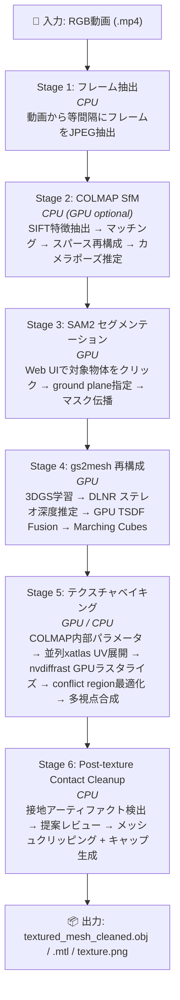

# clip2mesh

RGB動画から テクスチャ付き3Dメッシュ (OBJ) を生成する Docker 完結型パイプライン。

COLMAP による Structure-from-Motion、SAM2 によるインタラクティブ物体セグメンテーション、gs2mesh (3D Gaussian Splatting + DLNR ステレオ深度推定 + GPU TSDF Fusion) によるメッシュ再構成、nvdiffrast による GPU テクスチャベイキングを1コンテナで実行する。

## パイプライン概要



## 動作環境

| 項目 | 要件 |
|------|------|
| GPU | NVIDIA (CUDA Compute ≥ 7.0), VRAM 16GB 推奨 |
| Docker | 20.10 以上 + Docker Compose v2 |
| NVIDIA Container Toolkit | nvidia-docker2 または nvidia-container-toolkit |
| OS | Linux (Ubuntu 22.04 で検証済み) |

**VRAM ティア自動検出**: パイプライン起動時に GPU VRAM を自動検出し、ティアに応じて処理を最適化する (`scripts/vram_tier.py`)。

| ティア | VRAM | TSDF デバイス |
|--------|------|---------------|
| t18 | ≥ 17 GB | GPU (CUDA) |
| t16 | 14–17 GB | GPU (CUDA) |
| t12 | 10–14 GB | GPU (CUDA) |
| t8 | 7–10 GB | CPU (自動フォールバック) |
| t_other | < 7 GB | CPU (自動フォールバック) |

環境変数 `VRAM_TIER_OVERRIDE` でティアを手動指定することも可能。

## セットアップ
- ここ(https://docs.nvidia.com/datacenter/cloud-native/container-toolkit/latest/install-guide.html#with-apt-ubuntu-debian)を参考に、nvidia-container-toolkitを導入する
- Dockerランタイムを登録して再起動する
  - `  sudo nvidia-ctk runtime configure --runtime=docker`
  - `sudo systemctl restart docker `


## クイックスタート

```bash
# 1. リポジトリクローン
git clone <repo-url> && cd clip2mesh

# 2. Docker イメージビルド (初回 15〜30分)
docker compose build

# 3. 入力動画を配置
cp /path/to/video.mp4 data/input/

# 4. Web ダッシュボード起動
docker compose up
```

ブラウザで **http://localhost:7860** を開くと Web ダッシュボードが表示される。

1. **Video** ドロップダウンで動画を選択
2. **Target Object** で既存オブジェクトを選択、または新規 `Object Name` を入力
3. パラメータを必要に応じて調整 (Advanced Settings で詳細設定)
4. **Start Pipeline** をクリック
5. Stage 3 で SAM2 Canvas がアクティブになるので、対象物体を左クリック (除外は右クリック)
6. **Confirm Object** で対象物体を確定し、必要なら ground/contact surface を追加指定
7. **Confirm Ground & Propagate** または ground を skip して全フレームへ反映
8. Stage 4–5 は自動進行
9. Stage 6 で接地クリーンアップの提案がダッシュボードに表示され、Apply/Skip を選択
10. ログ・進捗・3Dプレビューをリアルタイムで確認
11. キャンセル/停止後の再開は、ステージバーで再開したいタスクを選択して **Start Pipeline** をクリック

## 使い方

### Web ダッシュボード (推奨)

```bash
docker compose up        # 起動
docker compose up -d     # バックグラウンド起動
docker compose down      # 停止
```

ブラウザで http://localhost:7860 を開き、GUI から全操作を行う。

### CLI 実行

```bash
# 基本実行
docker compose run --rm --service-ports \
  --entrypoint python3 \
  pipeline /app/scripts/pipeline.py /data/input/video.mp4

# 途中再開 (ステージ N から)
docker compose run --rm --service-ports \
  --entrypoint python3 \
  pipeline /app/scripts/pipeline.py /data/input/video.mp4 --skip-to 4
```

> **注意**: CLI モードでは Stage 3 で Gradio UI が起動する。
> CLI で Stage 6 を実行する場合、`--post-texture-cleanup-selection-json` で判定 JSON を指定可能 (JSON 形式: `{"decision": "apply"}` または `{"decision": "skip"}`)。未指定時はスキップ扱いになる。

## 環境変数

全パラメータの単一ソースは [`scripts/config_defaults.py`](scripts/config_defaults.py)。
ダッシュボードの Advanced Settings または `docker-compose.yml` の environment セクションで上書きできる。

よく使う変数:

| 変数 | デフォルト | 説明 |
|------|-----------|------|
| **Stage 1** | | |
| `MAX_FRAMES` | `50` | 抽出フレーム数の上限 |
| `FRAME_INTERVAL` | `10` | フレーム抽出間隔 |
| **Stage 2** | | |
| `COLMAP_MATCHER` | `exhaustive` | マッチング方式 (`exhaustive` / `sequential`) |
| `COLMAP_MAX_FEATURES` | `32768` | SIFT 特徴点の最大数 |
| `COLMAP_IMAGE_SIZE` | `2048` | 特徴抽出時の最大画像サイズ |
| `COLMAP_USE_GPU` | `false` | COLMAP の GPU 使用 |
| `COLMAP_DSP_SIFT` | `true` | DSP-SIFT (アフィン形状推定 + ドメインサイズプーリング) の有効化 |
| **Stage 3** | | |
| `SAM2_MODEL` | `large` | SAM2 モデルサイズ (`tiny` / `small` / `base` / `large`) |
| **Stage 4** | | |
| `GS2MESH_PRESET` | `default` | gs2mesh プリセット (`default` / `high` / `custom`) |
| `GS2MESH_GS_ITERATIONS` | `5000` | 3DGS 学習イテレーション数 |
| `GS2MESH_RUNTIME_PROFILE` | `auto` | ランタイムプロファイル (`auto` / `compat`) |
| `GS2MESH_STEREO_MODEL` | `DLNR_Middlebury` | ステレオ深度推定モデル |
| `GS2MESH_TSDF_VOXEL_SIZE` | `0.005` | TSDF ボクセルサイズ (m) |
| `GS2MESH_TSDF_DEPTH_TRUNC` | `0.04` | TSDF 深度切断距離 (m) |
| `GS2MESH_USE_MASKS` | `true` | SAM2 マスクを TSDF 統合に使用 |
| `MESH_DECIMATION` | `1` (有効) | `0` で Stage 4 のメッシュ簡略化を無効化 (旧挙動) |
| `MESH_TARGET_FACES` | (自動) | 簡略化後の目標三角形数。未指定時は VRAM ティア × プリセットから決定 (default=200K/high=500K、CPU TSDF時は80K/200K) |
| `MESH_DECIMATION_MIN_IOU` | `0.985` | 簡略化前後の 8 視点シルエット IoU 閾値。下回ると元メッシュへ自動 rollback |
| `MESH_DECIMATION_IOU_VIEWS` | `8` | IoU 検証に使う視点数。`0` で IoU セーフネットを無効化 |
| **Stage 5** | | |
| `TEXTURE_SIZE` | `0` (自動) | テクスチャ解像度。`0` は `round(sqrt(W*H))` を自動適用 |
| `TEXTURE_MAX_SIZE` | `2048` | 自動モード時の上限。`0` で無制限。`TEXTURE_SIZE>0` (manual) はバイパス |
| `TEXTURE_VIEW_ASSIGN_MODE` | `region_gc` | view 割当モード (`legacy` / `region_gc`) |
| `TEXTURE_QUALITY_BOOST` | `false` | 高品質境界 refinement の有効化 |
| `TEXTURE_UV_MAX_FACES` | `300000` | xatlas 入力の上限 (Stage 4 簡略化が無効化された場合の保険)。`0` で無制限 |
| **Stage 6** | | |
| `POST_TEXTURE_CLEANUP_ENABLED` | `true` | Post-texture contact cleanup の有効/無効 |
| **VRAM** | | |
| `VRAM_TIER_OVERRIDE` | (自動検出) | VRAM ティアの手動指定 (`t18` / `t16` / `t12` / `t8` / `t_other`) |

全変数の一覧は各ステージのドキュメント (下記) を参照。

## 出力ファイル

パイプライン完了後、`data/output/objects/<object_name>/` 配下にフェーズ別ディレクトリで生成される:

| パス | 説明 |
|---------|------|
| `p6_cleanup/<object_name>/textured_mesh_cleaned.obj` / `.mtl` / `texture.png` | 最終成果物: クリーンアップ済みテクスチャ付き3Dメッシュ |
| `p6_cleanup/<object_name>/texture_cap.png` | 接地キャップテクスチャ (cleanup apply 時) |
| `p6_cleanup/post_texture_contact_cleanup/proposal.json` | Stage 6 クリーンアップ提案 |
| `p5_texture/textured_mesh.obj` / `.mtl` / `texture.png` | Stage 5 出力: クリーンアップ前のテクスチャ付きメッシュ |
| `p4_mesh/object_mesh.ply` | Stage 4 出力: gs2mesh 再構成メッシュ |
| `p4_mesh/gs2mesh_workspace/` | gs2mesh 中間ファイル (3DGS チェックポイント、ステレオ深度マップ等) |
| `p3_masks/masks/` | canonical SAM2 final mask (`object_raw AND NOT ground_raw`) |
| `p3_masks/masks_object_raw/` / `masks_ground/` | raw object mask / raw ground subtraction mask |
| `p3_masks/ground_plane.json` | 推定された接地平面パラメータ |
| `p2_colmap/camera_poses.json` | COLMAP カメラ外部パラメータ (c2w 4x4 行列) |
| `p2_colmap/intrinsics.json` | COLMAP カメラ内部パラメータ (fx, fy, cx, cy, K) |
| `p2_colmap/colmap_sparse/` | COLMAP スパース再構成データ |
| `p2_colmap/colmap_sparse_points.ply` | COLMAP スパース点群 |
| `p1_frames/` | 抽出フレーム |
| `object_meta.json` | 取り込み時メタデータ (フェーズ非依存・ルート直下) |

すべてのフェーズパス定義は `scripts/output_layout.py` に集約されている。

全中間ファイルの詳細は各ステージのドキュメントを参照。

## VRAM とパフォーマンス

RTX 4090 Laptop (16GB) での参考値:

| ステージ | VRAM ピーク | 所要時間 (目安) |
|----------|-----------|---------|
| COLMAP SfM (CPU モード) | ≈ 0 GB (GPU 不使用) | 2–5 分 |
| SAM2 (large) | ≈ 2 GB | ≈ 15 秒 (伝播) |
| 3DGS 学習 (5K iter) | 8–12 GB | 3–5 分 |
| DLNR ステレオ深度 | 4–6 GB | 2–3 分 |
| GPU TSDF Fusion | 6–8 GB | ≈ 30 秒 |
| テクスチャベイキング | 2–4 GB | シーン依存 |

**VRAM 管理**: 各 GPU ステージ終了時に `cleanup_pytorch_vram()` でモデルを明示的に解放し VRAM を回収する。GPU TSDF は OOM 時に VRAM 削減パラメータで自動リトライ (requested → reduced_vram → safe_vram)。低 VRAM 環境では自動的に CPU TSDF にフォールバックする。

> **ヒント**: 16GB GPU で品質を優先する場合、`GS2MESH_GS_ITERATIONS` を増やし (例: 15000)、`GS2MESH_PRESET=high` を使用する。

## ドキュメント

各ステージの詳細 (環境変数一覧・アルゴリズム・出力ファイル) は `docs/` を参照:

| Stage | ドキュメント |
|-------|------------|
| 1. フレーム抽出 | [`docs/extract_frames.md`](docs/extract_frames.md) |
| 2. COLMAP SfM | [`docs/colmap_sfm.md`](docs/colmap_sfm.md) |
| 3. SAM2 セグメンテーション | [`docs/sam2_segment.md`](docs/sam2_segment.md) |
| 4. gs2mesh 再構成 | [`docs/gs2mesh_reconstruct.md`](docs/gs2mesh_reconstruct.md) |
| 5. テクスチャベイキング | [`docs/texture_bake.md`](docs/texture_bake.md) |
| 6. Post-texture Cleanup | [`docs/post_texture_cleanup.md`](docs/post_texture_cleanup.md) |

## テスト実行方法

```bash
# コンテナビルド
docker compose -f docker-compose.yml -f docker-compose.test.yml build test

# 全テスト実行
./run_tests.sh

# GPU なしテストのみ（高速）
./run_tests.sh -m "not gpu"

# GPU テストのみ
./run_tests.sh -m gpu

# 特定テスト
./run_tests.sh -k "test_sam2_service" -v
```

## ライセンス

本リポジトリのスクリプトは MIT ライセンス。依存プロジェクトは各自のライセンスに従う:

- [SAM2](https://github.com/facebookresearch/sam2) — Apache 2.0
- [COLMAP](https://github.com/colmap/colmap) — BSD 3-Clause
- [gs2mesh](https://github.com/yanivw12/gs2mesh) — Apache 2.0
- [3D Gaussian Splatting](https://github.com/graphdeco-inria/gaussian-splatting) — Inria / Max Planck Institute 独自ライセンス (**非商用利用のみ**。商用利用には権利者の事前許可が必要)
- [DLNR](https://github.com/David-Zhao-1997/High-frequency-Stereo-Matching-Network) — (リポジトリのライセンスを確認)
- [nvdiffrast](https://github.com/NVlabs/nvdiffrast) — NVIDIA Source Code License (**非商用研究/評価用途のみ**。商用利用には NVIDIA の別途ライセンスが必要)
- [Open3D](https://github.com/isl-org/Open3D) — MIT
- [xatlas](https://github.com/jpcy/xatlas) — MIT
