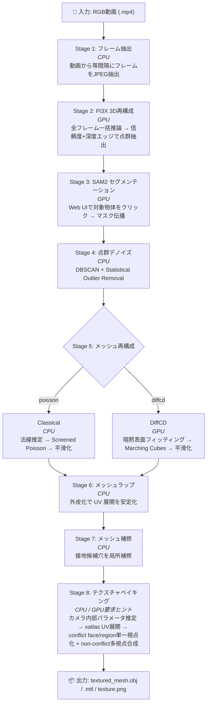

# clip2mesh

RGB動画から テクスチャ付き3Dメッシュ (OBJ) を生成する Docker 完結型パイプライン。

Pi3X による多視点3D再構成、SAM2 によるインタラクティブ物体セグメンテーション、古典手法 (法線推定 + Screened Poisson) / DiffCD のメッシュ化、チャート単位の最適視点テクスチャベイキングを1コンテナで実行する。

## パイプライン概要



## 動作環境

| 項目 | 要件 |
|------|------|
| GPU | NVIDIA (CUDA Compute ≥ 7.0), VRAM 16GB 推奨 |
| Docker | 20.10 以上 + Docker Compose v2 |
| NVIDIA Container Toolkit | nvidia-docker2 または nvidia-container-toolkit |
| OS | Linux (Ubuntu 22.04 で検証済み) |

## クイックスタート

```bash
# 1. リポジトリクローン
git clone <repo-url> && cd clip2mesh

# 2. Docker イメージビルド (初回 15〜30分)
docker compose build

# 3. 入力動画を配置
cp /path/to/video.mp4 data/input/

# 4. Web ダッシュボード起動
docker compose up
```

ブラウザで **http://localhost:7860** を開くと Web ダッシュボードが表示される。

1. **Video** ドロップダウンで動画を選択
2. **Target Object** で既存オブジェクトを選択、または新規 `Object Name` を入力
3. パラメータを必要に応じて調整 (Advanced Settings で詳細設定)
4. **Start Pipeline** をクリック
5. Stage 3 で SAM2 Canvas がアクティブになるので、対象物体を左クリック (除外は右クリック)
6. **Confirm & Propagate** で全フレームにマスク伝播 → 残りのステージは自動進行
7. ログ・進捗・3Dプレビューをリアルタイムで確認
8. キャンセル/停止後の再開は、ステージバーで再開したいタスクを選択して **Start Pipeline** をクリック

## 使い方

### Web ダッシュボード (推奨)

```bash
docker compose up        # 起動
docker compose up -d     # バックグラウンド起動
docker compose down      # 停止
```

ブラウザで http://localhost:7860 を開き、GUI から全操作を行う。

### CLI 実行

```bash
# 基本実行
docker compose run --rm --service-ports \
  --entrypoint python3 \
  pipeline /app/scripts/pipeline.py /data/input/video.mp4

# 途中再開 (ステージ N から)
docker compose run --rm --service-ports \
  --entrypoint python3 \
  pipeline /app/scripts/pipeline.py /data/input/video.mp4 --skip-to 4
```

> **注意**: CLI モードでは Stage 3 で Gradio UI が起動する。
> CLI で Stage 7 を実行する場合、`--repair-selection-json` が必須 (JSON 形式: `{"selected_loop_ids": [0, 3, 5]}`)。

## 環境変数

全パラメータの単一ソースは [`scripts/config_defaults.py`](scripts/config_defaults.py)。
ダッシュボードの Advanced Settings または `docker-compose.yml` の environment セクションで上書きできる。

よく使う変数:

| 変数 | デフォルト | 説明 |
|------|-----------|------|
| `MAX_FRAMES` | `50` | 抽出フレーム数の上限 |
| `PIXEL_LIMIT` | `255000` | フレームあたり最大ピクセル数 |
| `MESH_METHOD` | `poisson` | メッシュ再構成手法 (`poisson` / `diffcd`) |

全変数の一覧は各ステージのドキュメント (下記) を参照。

## 出力ファイル

パイプライン完了後、`data/output/objects/<object_name>/` に生成される主要ファイル:

| ファイル | 説明 |
|---------|------|
| `textured_mesh.obj` / `.mtl` / `texture.png` | 最終成果物: テクスチャ付き3Dメッシュ |
| `object.ply` | フィルタ済み点群 |
| `object_denoised.ply` | デノイズ済み点群 |
| `object_mesh.ply` | Stage 5 出力メッシュ |
| `camera_poses.json` | カメラ外部パラメータ |
| `frames/` / `masks/` | 抽出フレーム / SAM2 マスク |

全中間ファイルの詳細は各ステージのドキュメントを参照。

## VRAM とパフォーマンス

RTX 4090 Laptop (16GB) での実測値:

| ステージ | VRAM ピーク | 所要時間 |
|----------|-----------|---------|
| SAM2 (large) | ~2 GB | ~15秒 (伝播) |
| Pi3X (20フレーム, 150Kpx) | ~14 GB | ~1分 |
| DiffCD (res=384, 25Kバッチ) | ~10 GB | ~10分 |
| デノイズ / テクスチャ | CPU / CUDA (Texture) | シーン依存 |

**VRAM 管理**: 各 GPU ステージ終了時にモデルを明示的に解放し VRAM を回収する。Pi3X は VRAM 使用率 95% を目標にフレーム数を自動調整し、OOM 時はフレーム削減 → 解像度縮小 → チャンク推論の順でフォールバックする。

> **ヒント**: 16GB GPU で品質を優先する場合、まず `MAX_FRAMES` を下げて `PIXEL_LIMIT` は高めに維持する。
> 例: `MAX_FRAMES=20~28, PIXEL_LIMIT=220000~255000`

## ドキュメント

各ステージの詳細 (環境変数一覧・アルゴリズム・出力ファイル) は `docs/` を参照:

| Stage | ドキュメント |
|-------|------------|
| 1. フレーム抽出 | [`docs/extract_frames.md`](docs/extract_frames.md) |
| 2. Pi3X 3D再構成 | [`docs/pi3x_reconstruct.md`](docs/pi3x_reconstruct.md) |
| 3. SAM2 セグメンテーション | [`docs/sam2_segment.md`](docs/sam2_segment.md) |
| 4. 点群デノイズ | [`docs/denoise_point_cloud.md`](docs/denoise_point_cloud.md) |
| 5a. Classical メッシュ | [`docs/mesh_classical.md`](docs/mesh_classical.md) |
| 5b. DiffCD メッシュ | [`docs/mesh_diffcd.md`](docs/mesh_diffcd.md) |
| 6. メッシュラップ | [`docs/mesh_wrap.md`](docs/mesh_wrap.md) |
| 7. メッシュ補修 | [`docs/contact_hole_repair.md`](docs/contact_hole_repair.md) |
| 8. テクスチャベイキング | [`docs/texture_bake.md`](docs/texture_bake.md) |

## テスト実行方法

```bash
# コンテナビルド
docker compose -f docker-compose.yml -f docker-compose.test.yml build test

# 全テスト実行
./run_tests.sh

# GPU なしテストのみ（高速）
./run_tests.sh -m "not gpu"

# GPU テストのみ
./run_tests.sh -m gpu

# 特定テスト
./run_tests.sh -k "test_sam2_service" -v
```

## ライセンス

本リポジトリのスクリプトは MIT ライセンス。依存プロジェクトは各自のライセンスに従う:

- [SAM2](https://github.com/facebookresearch/sam2) — Apache 2.0
- [Pi3X](https://github.com/yyfz/Pi3) — MIT
- [DiffCD](https://github.com/Linusnie/diffcd) — MIT
